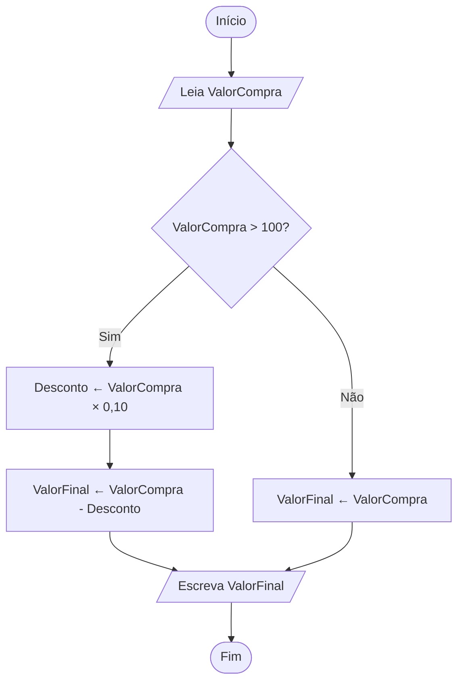

```mermaid
graph TD
    A([Início]) --> B[/Leia ValorCompra/]
    B --> C{ValorCompra > 100?}

    C -- Sim --> D[Desconto ← ValorCompra × 0,10]
    D --> E[ValorFinal ← ValorCompra - Desconto]

    C -- Não --> F[ValorFinal ← ValorCompra]

    E --> G[/Escreva ValorFinal/]
    F --> G

    G --> H([Fim])
```