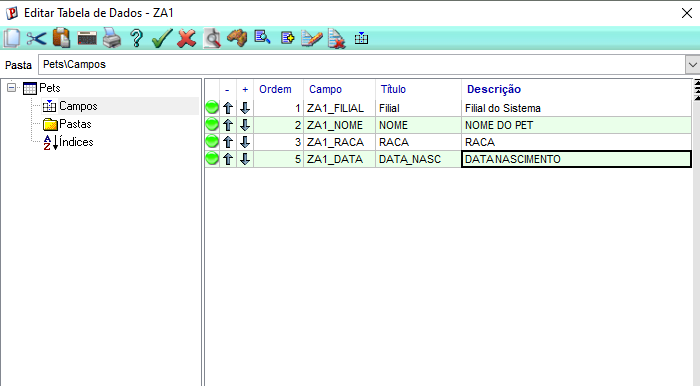
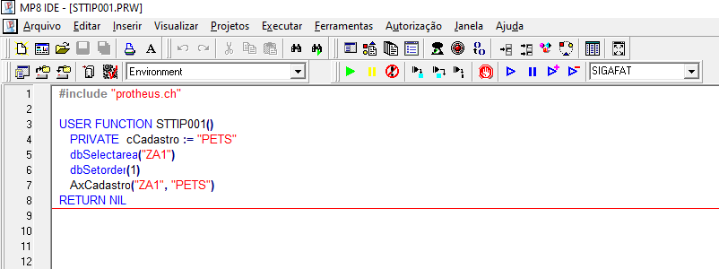
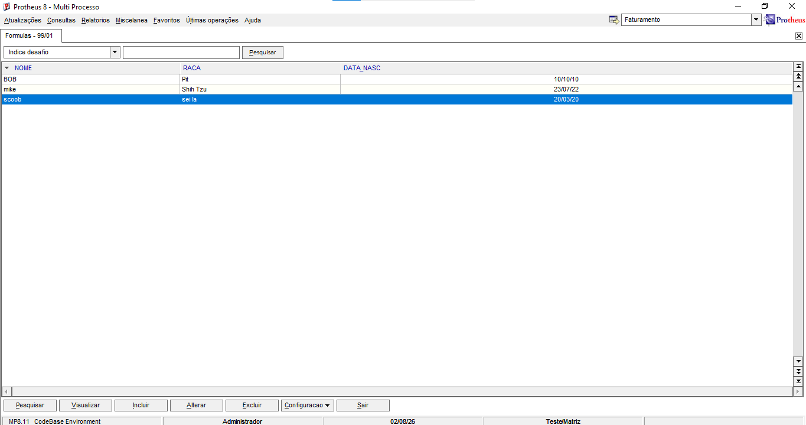
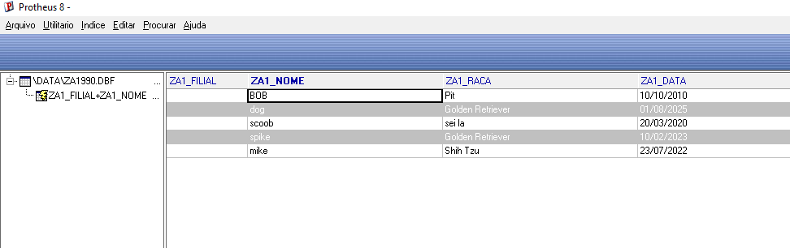

# 📑 Guia de Criação de Tabela, Programa AdvPL e Auditoria no Protheus

---

## 🛠️ PASSO 1 — Criar a Estrutura da Tabela ZA1 no Configurador

> ⚠️ **NOTA:** Antes de iniciar os passos, certifique-se de que o Protheus AppServer (servidor) está ativo e rodando.

### 1.1. Acessar o Configurador (SIGACFG)
1. Abra o **SmartClient**.
2. No campo **Programa Inicial**, digite: `SIGACFG`.
3. Preencha os campos de **Comunicação no Cliente** e **Ambiente no Servidor** de acordo com o seu ambiente.
4. Clique em **OK**.

### 1.2. Criar a Tabela no Dicionário (SX2)
1. No menu superior do Configurador, acesse: **Base de Dados** ➡️ **Dicionário** ➡️ **Base de Dados**.
2. Clique no ícone **Dicionário de Dados** na árvore de diretórios.
3. 🔍 *Nota de segurança:* Antes de continuar, clique na **Lupa (Pesquisar)** e digite `ZA1` para verificar se essa tabela já existe no ambiente.
4. Caso não exista, clique no ícone **"+" (Incluir)** na barra superior para criar uma nova tabela.
5. Na janela de cadastro, preencha os seguintes campos:
   * **Prefixo:** `ZA1` (pressione `Enter`. O sistema gerará o nome físico completo automaticamente, ex: `ZA1990`).
   * **Path:** `\DATA\`
   * **Nome:** `ZA1`
   * **Descrição:** `Cadastro de Pets`
   * **Modo de Acesso:** `COMPARTILHADO`
   * **Rotina:** *Deixe em branco.*
6. Clique no ícone de **Confirmar (Visto verde)** para gravar.
7. Na tela de confirmação do dicionário, clique em **Salvar** novamente.

### 1.3. Adicionar os Campos (SX3)
Agora serão adicionados os campos estruturais da tabela: `ZA1_NOME`, `ZA1_RACA` e `ZA1_NASC`.

#### 🔹 Campo 1: ZA1_NOME (Nome do Pet)
1. Com a tabela `ZA1` selecionada na tela, clique no ícone de **Editar (Lápis)**.
2. Clique no símbolo de **"+"** ao lado do nome da tabela para expandir a árvore de propriedades e selecione a aba **Campos**.
3. Clique no botão **Incluir ("+")** na parte superior da janela dos campos.
4. Preencha as abas com as seguintes configurações:
   * **Aba "Campo":**
     * **Nome:** `ZA1_NOME`
     * **Tipo:** `Caracter`
     * **Tamanho:** `40`
     * **Decimais:** `0`
     * **Formato / Form Variável:** *Deixe vazio.*
     * **Contexto:** `1 - Real`
     * **Propriedade:** `Alterar`
   * **Aba "Informações":**
     * **Título:** `NOME`
     * **Descrição:** `Nome do Pet`
   * **Aba "Uso":**
     * Marque as opções **Usado** e **Browse**.
5. Clique em **Confirmar (Visto verde)**.
6. Avance as telas de resumo clicando em **Avançar** e finalize em **Finalizar**.

#### 🔹 Campo 2: ZA1_RACA (Raça do Pet)
1. Repita o mesmo procedimento de inclusão de campo e preencha:
   * **Nome:** `ZA1_RACA`
   * **Tipo:** `Caracter`
   * **Tamanho:** `40`
   * **Título:** `RACA`
   * **Descrição:** `Raça do Pet`
   * **Uso:** Marque **Usado** e **Browse**.

#### 🔹 Campo 3: ZA1_NASC (Data de Nascimento)
1. Repita o mesmo procedimento de inclusão de campo e preencha:
   * **Nome:** `ZA1_NASC`
   * **Tipo:** `Data`
   * **Tamanho:** `8`
   * **Título:** `DATA_NASC`
   * **Descrição:** `Data de Nascimento`
   * **Uso:** Marque **Usado** e **Browse**.

📸 **Resultado final do preenchimento dos campos:**


### 1.4. Criar os Índices da Tabela (SIX) — Obrigatório!
1. Na mesma janela de edição da tabela `ZA1`, clique na aba **Índices**.
2. Clique no botão **Incluir ("+")**.
3. Preencha as propriedades do índice:
   * **Chave:** `ZA1_FILIAL+ZA1_NOME` *(Obrigatório iniciar com a filial).*
   * **Nickname:** *Deixe em branco.*
   * **Descrição:** `Índice por Filial + Nome`
4. Clique em **Confirmar (Visto verde)**.

### 1.5. Salvar e Aplicar as Alterações no Banco de Dados
1. Na janela principal do Dicionário de Dados, clique no ícone do **Disquete (Atualizar Base de Dados)** para aplicar as mudanças fisicamente no banco.
2. Na tela do assistente que se abre, clique em **Avançar** ➡️ **Avançar** ➡️ **Finalizar**.
3. Feche a janela de edição clicando no ícone de **Sair (Porta)**.
4. Sua tabela `ZA1` está criada e pronta no dicionário!  

---

## 💻 PASSO 2 — Compilar o Programa AdvPL e Forçar o Reconhecimento da Tabela

> ⚠️ **NOTA:** Feche o SmartClient antes de iniciar os passos abaixo.

### 2.1. Desenvolvimento do Código no DevStudio
1. Abra o **TOTVS Developer Studio (DevStudio)**.
2. Caso ainda não tenha uma pasta de projeto configurada, crie uma pasta local chamada `dev`.
3. Crie um novo arquivo de código-fonte e escreva o programa abaixo:

```advpl
#include "protheus.ch"   

USER FUNCTION STTIP001()      
    PRIVATE cCadastro := "PETS"
    dbSelectArea("ZA1")
    dbSetOrder(1)
    AxCadastro("ZA1", "PETS")
    
RETURN NIL
```

📸 **Código implementado no TOTVS Developer Studio:**


#### 🔍 Entendendo os comandos do código:
* `#include "protheus.ch"`: Carrega os arquivos de cabeçalho necessários com os recursos e definições padrão do AdvPL.
* `USER FUNCTION STTIP001()`: Declaração de uma função customizada de usuário. O nome da rotina é `STTIP001`.
* `PRIVATE cCadastro := "PETS"`: Cria uma variável de escopo privado com o título do cadastro.
* `dbSelectArea("ZA1")`: Seleciona a área de trabalho da tabela `ZA1`, posicionando o cursor do sistema nela.
* `dbSetOrder(1)`: Ativa o índice número 1 (`ZA1_FILIAL + ZA1_NOME`) para organizar as buscas na tabela por filial e nome.
* `AxCadastro("ZA1", "PETS")`: Abre a tela de CRUD nativa do Protheus (Incluir, Alterar, Excluir e Visualizar). Ela lê o dicionário de dados (SX3/SIX) para montar o visual automaticamente.
* `RETURN NIL`: Encerra a execução da função sem retornar nenhum valor.


### 2.2. Salvando e Compilando o Projeto
1. Acesse o menu **Projeto** ➡️ **Salvar Como...** e salve o projeto como `STTIP001.prj`.
2. Abra o **Gerenciador de Projetos**, clique no ícone do **Disquete (Salvar)** e salve o arquivo fonte como `STTIP001.prw`.
3. No Gerenciador de Projetos, certifique-se de que o arquivo `.prw` está alocado dentro da pasta **Fontes** (se necessário, clique no botão **"+"** para expandir a árvore).
4. No menu superior, clique em **Projeto** ➡️ **Compilar**.
5. Insira as credenciais de compilação do ambiente (Padrão: Usuário `admin` / Senha em branco).
6. Aguarde a mensagem de confirmação de compilação com sucesso no console.

### 2.3. Executando o Programa via Rotina de Fórmulas (SIGAMDI)
1. Abra o **SmartClient** informando o programa inicial `SIGAMDI`.
2. Entre com suas credenciais (Usuário em branco / Senha em branco) e confirme.
3. No seletor de ambiente, selecione o módulo **Faturamento** e clique em confirmar.
4. No menu superior, siga o caminho: **Atualizações** ➡️ **Cadastro** ➡️ **Fórmulas**.
5. Na tela de fórmulas, clique no botão **Incluir** (menu inferior).
6. Preencha os campos obrigatórios da fórmula:
   * **Código:** *Insira qualquer número disponível.*
   * **Descrição:** *Insira qualquer texto de identificação (Ex: Executa Cadastro Pets).*
   * **Fórmula:** `U_STTIP001()` *(O prefixo `U_` é obrigatório para chamar funções de usuário).*
7. Clique em **Confirmar** para salvar. A tela do seu cadastro de Pets será aberta automaticamente através do framework. 
8. Teste a rotina clicando em **Incluir**, insira dados fictícios nos campos do Pet e salve clicando no **Visto**.

📸 **Resultado final do cadastro de Pets com dados adicionados:**


---

## 🔍 PASSO 3 — Conferir a Estrutura Final no MPSDU

O MPSDU é o utilitário de banco de dados do Protheus que permite auditar as tabelas diretamente.

### 3.1. Acessar o MPSDU
1. Abra o **SmartClient**.
2. No campo **Programa Inicial**, digite: `MPSDU`.
3. Confirme as configurações de ambiente e clique em **OK**.
4. Faça o login utilizando o usuário `admin` (Senha em branco).

### 3.2. Abrir e Auditar a Tabela Física
1. No menu superior do MPSDU, clique em **Arquivo** ➡️ **Abrir**.
2. No seletor de Driver/Banco, selecione a extensão correspondente do seu ambiente (Ex: **DBF** ou o banco de dados correspondente) e clique em OK.
3. Na janela de navegação de pastas, expanda a árvore clicando no botão **"+"** e acesse a pasta **Data**.
4. Localize o arquivo físico da tabela, que provavelmente se chamará **`za1990.dbf`** (ou nome similar dependendo da numeração da sua empresa).
5. Dê **dois cliques** sobre o arquivo.
6. Pronto! A tabela abrirá na tela, permitindo que você visualize os registros inseridos pelo seu programa e valide se a estrutura física de campos reais foi criada com sucesso no banco de dados. 

📸 **Visualização física da tabela ZA1 aberta no MPSDU:**

