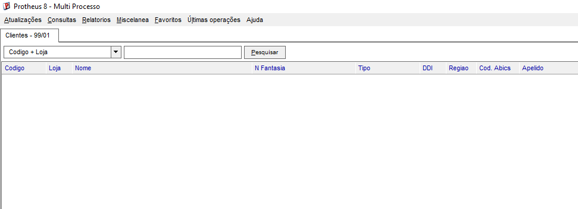

# 📑 Guia de Customização: Criando o Campo A1_XAPELID na Tabela SA1 (Clientes)

O fluxo para criar um campo customizado em uma tabela nativa é muito semelhante ao processo utilizado na tabela `ZA1`. A grande diferença é que, em vez de criar uma tabela do zero, editaremos a estrutura da tabela **SA1** diretamente no Dicionário de Dados.

---

## 🛠️ PASSO 1 — Configuração do Campo no Dicionário de Dados

### 1.1. Acessar o Configurador (SIGACFG)
1. Abra o **SmartClient**.
2. No campo **Programa Inicial**, digite: `SIGACFG`.
3. Faça o login normalmente com suas credenciais de administrador.

### 1.2. Localizar a Tabela SA1 no Dicionário
1. No menu superior do Configurador, acesse: **Base de Dados** ➡️ **Dicionário** ➡️ **Base de Dados**.
2. Clique no ícone **Dicionário de Dados** na árvore de diretórios.
3. Clique na **Lupa (Pesquisar)** na barra de ferramentas superior.
4. Digite `SA1` e pressione `Enter` para localizar a tabela oficial de Clientes do ERP.

### 1.3. Editar a Tabela e Incluir o Novo Campo
1. Selecione a tabela **SA1** na lista e clique no ícone **Editar (Lápis)**.
2. Clique no símbolo de **"+"** ao lado do nome da tabela para expandir as propriedades e selecione a aba **Campos**.
3. Clique no botão **Incluir ("+")** na parte superior da janela dos campos para criar o campo personalizado.

### 1.4. Configurar as Propriedades do Campo A1_XAPELID
Preencha as abas exatamente com as propriedades técnicas abaixo:

* **Aba "Campo":**
  * **Nome:** `A1_XAPELID` *(O prefixo `X` após o `A1_` identifica que é um campo customizado pelo cliente, evitando conflitos com atualizações da TOTVS).*
  * **Tipo:** `Caracter`
  * **Tamanho:** `30`
  * **Decimais:** `0`
  * **Contexto:** `1 - Real` *(Significa que ele será gravado fisicamente no banco de dados).*
  * **Propriedade:** `Alterar`
* **Aba "Informações":**
  * **Título:** `Apelido` *(O nome que o usuário final verá na tela do sistema).*
  * **Descrição:** `Apelido do Cliente`
* **Aba "Uso":**
  * Marque as opções **Usado** e **Browse**. 
  * *Por que isso é essencial?* O marcador **Usado** ativa o campo para manipulação no sistema, e o **Browse** permite que ele vire uma coluna visualizável nas listagens e telas de consulta.

1. Clique no ícone de **Confirmar (Visto verde)** para fechar as propriedades do campo.
2. No assistente de resumo do dicionário que se abrirá em seguida, clique em **Avançar** ➡️ **Avançar** ➡️ **Finalizar**.

### 1.5. Salvar e Aplicar as Alterações no Banco de Dados
1. De volta à janela principal do Dicionário de Dados, clique no ícone do **Disquete (Atualizar Base de Dados)** para consolidar a alteração.
2. Na tela do assistente que se abre, confirme a atualização clicando em **Avançar** ➡️ **Avançar** ➡️ **Finalizar**.
3. Feche a janela de edição clicando no ícone de **Sair (Porta)**.

---

## 🧪 PASSO 2 — Validando o Resultado no ERP

> ⚠️ **IMPORTANTE:** Feche completamente o SmartClient que utilizou no Configurador para que o framework do Protheus limpe o cache e reconheça a nova estrutura física do banco de dados na próxima inicialização.

### 2.1. Executar o Cadastro de Clientes
1. Abra o **SmartClient** informando o programa inicial `SIGAMDI` (ou faça o acesso direto pelo módulo desejado).
2. Entre com suas credenciais de acesso ao sistema.
3. No seletor de ambiente, selecione o módulo **Faturamento** (ou outro módulo que possua a gestão de clientes).
4. No menu superior, siga o caminho: **Atualizações** ➡️ **Cadastros** ➡️ **Clientes**.

### 2.2. Visualizar o Novo Campo em Tela
1. Selecione qualquer cliente da listagem e clique em **Alterar** ou **Visualizar**.
2. Navegue pelas abas do cadastro de clientes (geralmente na aba *Cadastrais* ou *Outros* dependendo do layout do seu ambiente).
3. Você verá que o campo **Apelido** já estará desenhado em tela, pronto para receber dados e salvar no banco de dados, de forma automática e sem a necessidade de programar nenhuma linha de código AdvPL!

📸 **Campo Apelido integrado com sucesso na tela de Clientes (SA1):**

