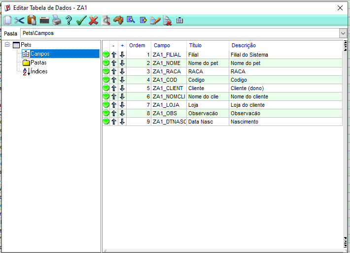
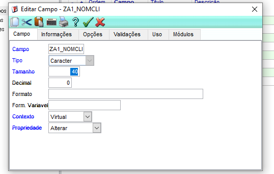
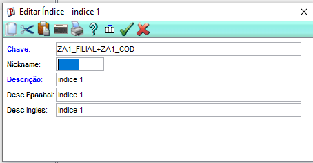
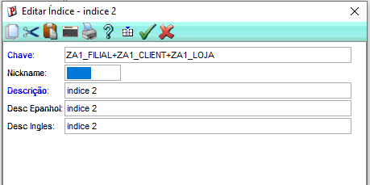

# 🛠️ Passo a Passo Detalhado: Configuração de Campos e Índices da Tabela ZA1

> ⚠️ **NOTA:** Antes de iniciar os passos, certifique-se de que o Protheus AppServer (servidor) está ativo e rodando em seu ambiente.

---

### 1. Criação e Configuração dos Campos (SX3)

1. Acesse o **Configurador (SIGACFG)** e preencha as informações de login com suas credenciais de administrador.
2. No menu superior, acesse: **Base de Dados** ➡️ **Dicionário** ➡️ **Base de Dados**.
3. Na árvore de diretórios, procure pela tabela **ZA1**, selecione-a, clique no ícone de **Editar (Lápis)** e vá para a aba **Campos**.
4. Clique no botão **Incluir ("+")** e adicione cada campo um por um, preenchendo corretamente as abas *Campo*, *Informações* e *Uso*.

> ⚠️ **NOTA:** Antes de salvar cada novo campo, verifique atentamente se todas as informações e tamanhos foram digitados corretamente conforme a tabela abaixo:

#### 📋 Estrutura de Campos da Tabela ZA1 (Dicionário de Dados)

| Campo | Título | Tipo | Tamanho | Decimais | Contexto | Descrição |
| :--- | :--- | :---: | :---: | :---: | :---: | :--- |
| **ZA1_FILIAL** | Filial | Caracter | 2 | 0 | **Real** | Código da filial corrente (obrigatório) |
| **ZA1_COD** | Código | Caracter | 6 | 0 | **Real** | Código identificador do pet |
| **ZA1_CLIENT** | Cliente (dono) | Caracter | 6 | 0 | **Real** | Código do cliente proprietário |
| **ZA1_LOJA** | Loja do cliente | Caracter | 2 | 0 | **Real** | Loja do cliente proprietário |
| **ZA1_NOMCLI** | Nome do cliente | Caracter | 40 | 0 | **Virtual** | Nome do cliente (trazido via consulta) |
| **ZA1_NOME** | Nome do pet | Caracter | 30 | 0 | **Real** | Nome de identificação do animal |
| **ZA1_RACA** | Raça | Caracter | 20 | 0 | **Real** | Raça ou variedade do pet |
| **ZA1_DTNASC** | Nascimento | Data | 8 | 0 | **Real** | Data de nascimento do pet |
| **ZA1_OBS** | Observação | Caracter | 60 | 0 | **Real** | Observações e anotações gerais |

📸 **Evidência da estrutura final de campos configurada no Protheus:**

---

### 2. Atenção Especial ao Campo Virtual

> ⚠️ **NOTA IMPORTANTE:** O campo **ZA1_NOMCLI** (Nome do Cliente) possui o contexto configurado estritamente como **Virtual**. Isso significa que ele não ocupará espaço físico no banco de dados, servindo apenas para buscar dinamicamente e exibir em tempo de execução o nome armazenado no cadastro da tabela SA1 (Clientes).

📸 **Evidência da configuração do campo virtual ZA1_NOMCLI no Configurador:**

---

### 3. Criação e Configuração dos Índices (SIX)

1. Na mesma janela de edição da tabela **ZA1**, navegue até a aba **Índices**.
2. Clique no botão **Incluir ("+")** para adicionar a chave primária da tabela:

* **Índice 1:** `ZA1_FILIAL + ZA1_COD`  
  * *Descrição:* Chave primária para identificação única do pet.

📸 **Evidência da configuração do Índice 1 no Configurador:**

3. Clique novamente no botão **Incluir ("+")** para adicionar a chave estrangeira de relacionamento:

* **Índice 2:** `ZA1_FILIAL + ZA1_CLIENT + ZA1_LOJA`  
  * *Descrição:* Chave estrangeira para buscar e agrupar os pets por proprietário.

📸 **Evidência da configuração do Índice 2 no Configurador:**

